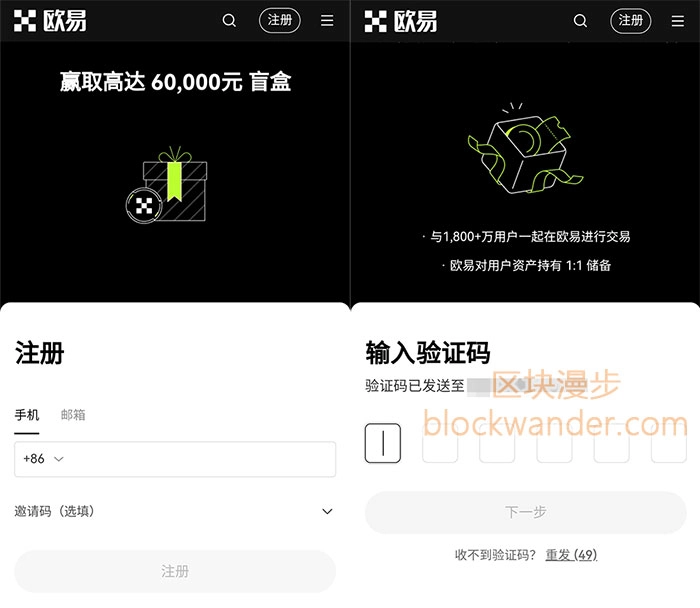
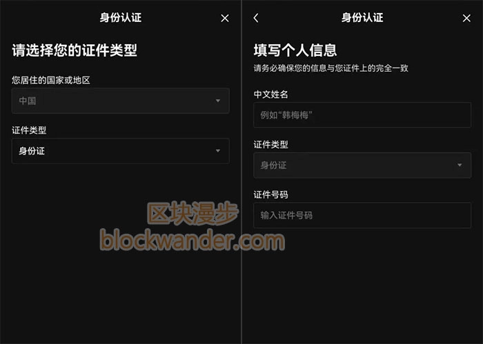

# OKX欧易交易所注册教程：国内用户开户完整指南

---

作为全球主流的加密货币交易平台，OKX（原OKEx）凭借简洁的界面设计和完善的产品线，吸引了大量国内用户。如果你也想入场数字货币交易，但不知道如何注册欧易账号，这篇教程会手把手教你完成整个开户流程——从访问官网到完成身份认证，全程不到10分钟。

---

## 第1步：访问OKX官方网站

注册前最重要的一点：**必须通过官方渠道注册**。

欧易的官网域名很好记，就是"OKX"加上常见的".com"后缀。不过由于网络环境限制，部分地区可能无法直接打开。如果遇到这种情况，建议开启代理工具访问官网，确保账户安全。

平台也提供了备用网址，但从安全角度考虑，还是推荐通过全球官网注册。

---

## 第2步：填写注册信息并领取新人奖励

打开官网后，注册流程非常直观：

1. **选择注册方式**：默认是手机号注册（国内手机号可用），也可以切换到邮箱注册
2. **输入信息**：填写手机号或邮箱后，注册按钮会从灰色变为可点击状态
3. **验证身份**：你会收到一条验证码短信或邮件，输入后设置登录密码即可

完成注册后别急着关页面——**新用户现在完成身份认证就能领取加密货币盲盒**，里面随机包含比特币、以太坊、狗狗币或平台币OKB，最高价值可达6万元。这相当于白送的开户福利，记得去领。

👉 [点击注册OKX领取新人盲盒奖励](https://www.okx.com/join/62834398)

---

## 第3步：下载欧易App（可选）

如果你是在电脑上完成注册的，其实不下载App也能正常交易。但考虑到手机端操作更便捷，建议还是装一个。

**下载方式：**
- **安卓用户**：按照页面提示下载APK安装包
- **苹果用户**：会自动跳转到App Store
- **或者**：直接在应用商店搜索"欧易"下载

装好App后，用刚才注册的手机号或邮箱登录就行。

---

## 第4步：完成身份认证（KYC）

由于加密货币的匿名特性，正规交易所都会要求用户进行实名认证，这是监管合规的必要步骤。

登录App后，首页会显眼地提示你完成身份认证。点进去按流程操作：

1. **选择证件类型**：国内用户选身份证
2. **填写个人信息**：输入真实姓名和证件号
3. **人脸识别**：找个光线充足的地方，跟着提示完成活体检测

整个过程大概2-3分钟，通过后你的账户权限就完全开放了。

---

## 注册完成后可以做什么？

拿到账号后，你就能体验OKX的完整功能了：

- **现货交易**：买卖比特币、以太坊等主流币种
- **合约交易**：杠杆做多做空，适合有经验的玩家
- **Web3钱包**：内置钱包功能，可以直接参与链上DeFi项目
- **理财产品**：稳健型用户可以选择币种质押赚利息

App的界面设计很直观，常用功能都放在首页，新手也能快速上手。

---

到这里，整个注册流程就结束了。OKX作为头部交易所，在产品易用性和功能完整度上确实做得不错。如果你打算进入数字货币领域，👉 [通过官方渠道注册OKX](https://www.okx.com/join/62834398) 是个稳妥的起点——不仅平台资质可靠,新人还能领到实打实的开户奖励。
